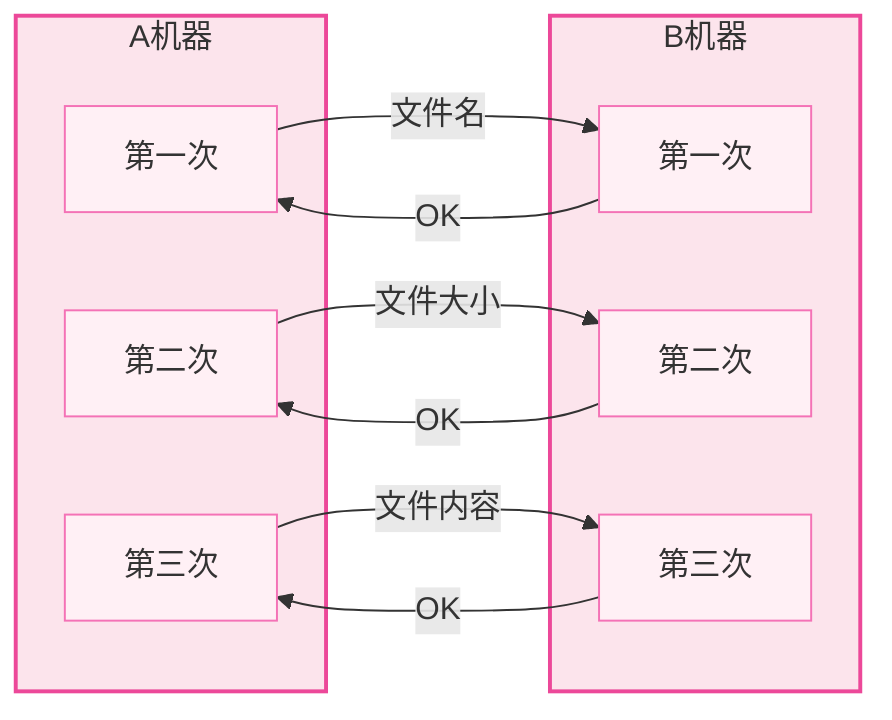
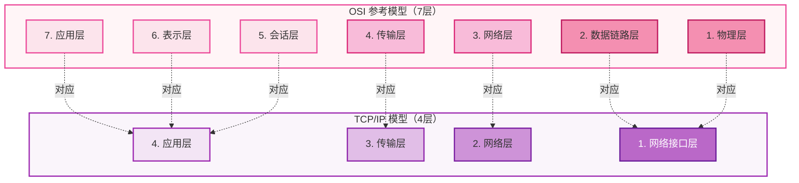
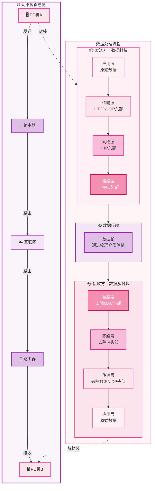

> 从今天（26.04.13）开始，进军 `Linux网络编程` ，目前打算是跟着阿b上 `"黑马"` 的课和游双的 `《Linux高性能服务器编程》` 学习，希望在大二之前可以再学习下 `OS` 然后搞搞 `dpdk`。来呲狗哦！

1.1
协议（Protocol）：协议可以理解为数据传输和数据解释的规则。简单理解为各个主机之间通信所使用的共同语言。

举一个这样的例子，A、B机器要发送文件：

从A上传文件到服务器B，需要在A和B之间制定一个双方都认可的规则，就称为文件传输协议，该协议是ftp协议的一个初级版本，后续优化形成了ftp协议。

典型协议：
传输层：TCP/UDP
应用层：HTTP、FTP
网络层：IP、ICMP、IGMP
网络接口层：ARP、RARP

TCP 传输协议控制 (Transmission Control Protocol)：是一种面向连接的、可靠的、基于字节流的传输层通信协议。

UDP 用户数据报协议 (User Datagram Protocol)：是 OSI 参考模型中一种无连接的传输层协议，提供面向事务的简单不可靠的信息传送服务。

HTTP 超文本传输协议 (HyperText Transfer Protocol)：是一种基于 TCP 协议的应用层协议，用于在 Web 浏览器和 Web 服务器之间传输超文本文档。

FTP 文件传输协议 (File Transfer Protocol)：是一种基于 TCP 协议的应用层协议，用于在客户端和服务器之间传输文件。

IP 协议 (Internet Protocol)：是一种用于在互联网上传输数据的网络层协议，提供无连接的服务。

ICMP 协议是 Internet 控制报文协议 (Internet Control Message Protocol)：它是 TCP/IP 协议族的一个子协议，用于在 IP 主机、路由器之间传递控制信息。

IGMP 协议是 Internet 组管理协议 (Internet Group Management Protocol)：是因特网协议家族中的一个组播协议，用于多播通信的网络层协议，该协议运行在主机和组播路由器之间。

ARP 协议是正向地址解析协议 (Address Resolution Protocol)：是一种用于将 IP 地址转换为物理地址的网络接口层协议，用于在局域网内解析主机地址。通过已知的 IP 寻找对应主机的 MAC 地址。

RARP 协议是反向地址解析协议 (Reverse Address Resolution Protocol)：是一种用于将物理地址转换为 IP 地址的网络接口层协议，用于在局域网内解析主机 地址的反向映射。通过 MAC 地址确定 IP 地址。

1.2
OSI (Open Systems Interconnection)：开放系统互联模型，是一种用于描述计算机网络的参考模型，是设计和描述计算机网络通信的基本框架。

网络分层 OSI 7层模型：物数网传会表应

1、物理层 -- 双绞线，光纤（传输介质），将模拟信号（高/低电平）转换为数字信号（1/0）。（调制解调器modemn，模数转换和数模转换。）

2、数据链路层 -- 数据校验，定义了网络传输的基本单位 - 帧（网络报文格式）。

3、网络层 -- 定义网络，两台机器之间传输的路径选择，点到点的传输。（比如A -> B -> C,A -> B 就是节点 A 到节点 B。）（IP协议 -- 路由器。）

4、传输层 -- 传输数据 TCP，UDP，端到端的传输。（比如A -> B -> C,A -> C 就是 A 端到 C 端，A 和 C 是两端。）（我们编程主要站在传输层的协议上。）

5、会话层 -- 通过传输层建立数据传输的通道。建立会话、保持会话。（直接感知不到，是内核帮忙实现的）

6、表示层 -- 编解码，翻译工作。

7、应用层 -- 应用程序，比如：email服务、ftp服务、ssh服务、http服务等。（使用、开发。）

OSI 7层模型与 TCP/IP 4层模型（真正使用）的对应关系：

1.3
数据的流向（从PC机A到PC机B）：

**数据封装过程（从上到下）**：
- 应用层：原始数据
- 传输层：添加 TCP/UDP 头部
- 网络层：添加 IP 头部
- 链路层：添加 MAC 头部和尾部

**数据解封装过程（从下到上）**：
- 链路层：去除 MAC 头部和尾部
- 网络层：去除 IP 头部
- 传输层：去除 TCP/UDP 头部
- 应用层：得到原始数据
