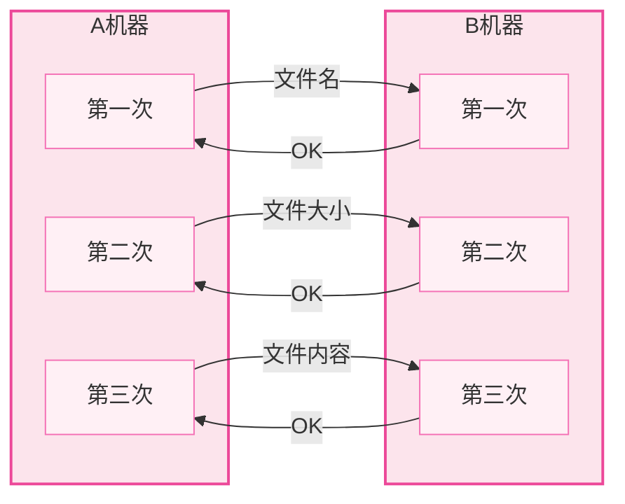
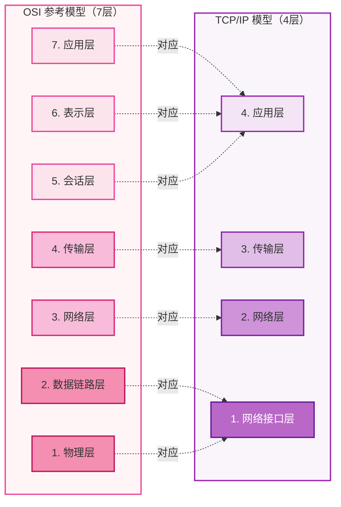
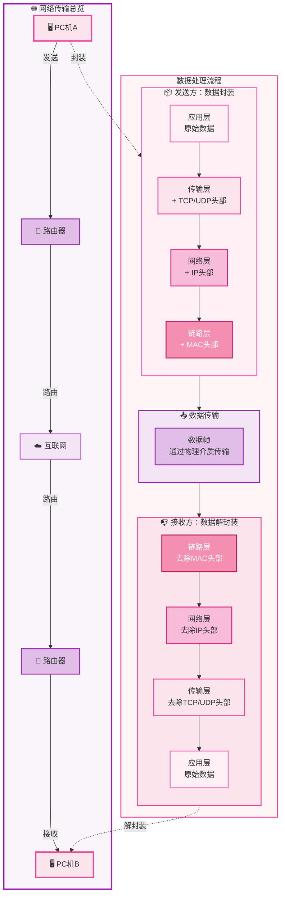
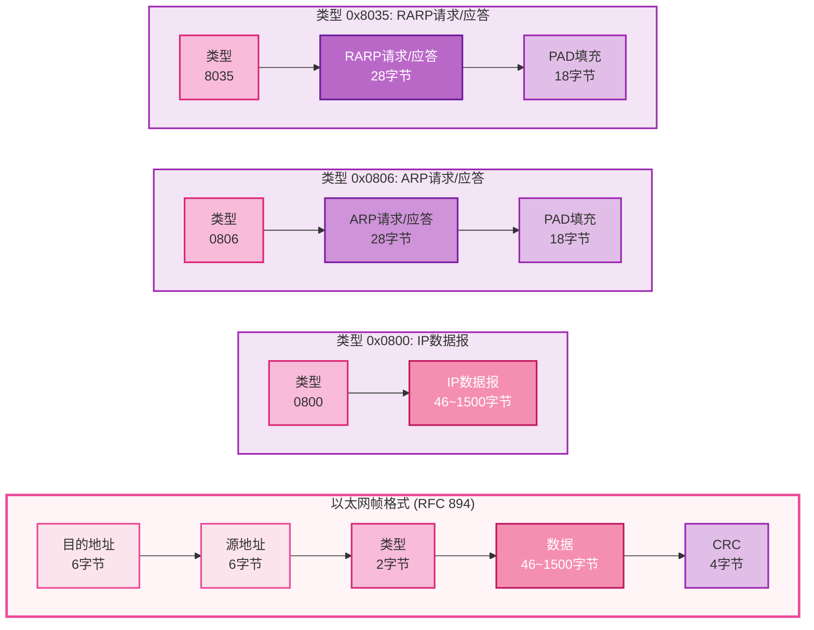
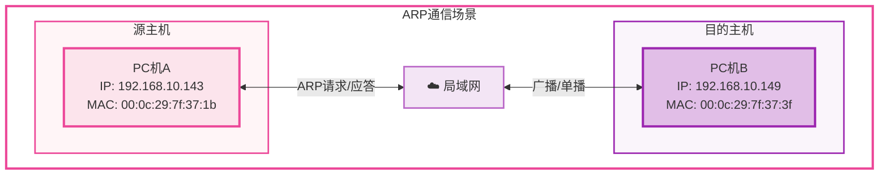
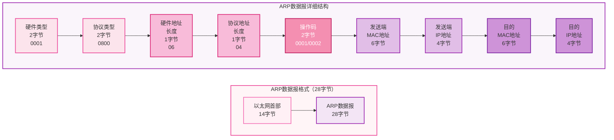

> 从今天（26.04.13）开始，进军 `Linux网络编程`，目前打算是跟着阿b上 **"黑马"** 的课和游双的《Linux高性能服务器编程》学习，希望在大二之前可以再学习下 `OS` 然后搞搞 `dpdk`。来呲狗哦！（到时候找老师要一个有网卡的服务器，或者先在VM上玩吧~）

---

# 1 基础概念

## 1.1 协议（Protocol）

协议可以理解为**数据传输和数据解释的规则**。简单理解为各个主机之间通信所使用的共同语言。

### 文件传输示例

举一个这样的例子，A、B 机器要发送文件：

从 A 上传文件到服务器 B，需要在 A 和 B 之间制定一个双方都认可的规则，就称为**文件传输协议**，该协议是 FTP 协议的一个初级版本，后续优化形成了 FTP 协议。

### 典型协议

| 层级 | 协议 |
|:---:|:---|
| **传输层** | TCP / UDP |
| **应用层** | HTTP、FTP |
| **网络层** | IP、ICMP、IGMP |
| **网络接口层** | ARP、RARP |

### 协议详解

- **TCP**（Transmission Control Protocol，传输协议控制）：是一种面向连接的、可靠的、基于字节流的传输层通信协议。

- **UDP**（User Datagram Protocol，用户数据报协议）：是 OSI 参考模型中一种无连接的传输层协议，提供面向事务的简单不可靠的信息传送服务。

- **HTTP**（HyperText Transfer Protocol，超文本传输协议）：是一种基于 TCP 协议的应用层协议，用于在 Web 浏览器和 Web 服务器之间传输超文本文档。

- **FTP**（File Transfer Protocol，文件传输协议）：是一种基于 TCP 协议的应用层协议，用于在客户端和服务器之间传输文件。

- **IP**（Internet Protocol）：是一种用于在互联网上传输数据的网络层协议，提供无连接的服务。

- **ICMP**（Internet Control Message Protocol，Internet 控制报文协议）：它是 TCP/IP 协议族的一个子协议，用于在 IP 主机、路由器之间传递控制信息。

- **IGMP**（Internet Group Management Protocol，Internet 组管理协议）：是因特网协议家族中的一个组播协议，用于多播通信的网络层协议，该协议运行在主机和组播路由器之间。

- **ARP**（Address Resolution Protocol，正向地址解析协议）：是一种用于将 IP 地址转换为物理地址的网络接口层协议，用于在局域网内解析主机地址。通过已知的 IP 寻找对应主机的 MAC 地址。

- **RARP**（Reverse Address Resolution Protocol，反向地址解析协议）：是一种用于将物理地址转换为 IP 地址的网络接口层协议，用于在局域网内解析主机地址的反向映射。通过 MAC 地址确定 IP 地址。

---

## 1.2 OSI 参考模型

**OSI**（Open Systems Interconnection，开放系统互联模型）是一种用于描述计算机网络的参考模型，是设计和描述计算机网络通信的基本框架。

### 网络分层 OSI 7层模型

> 口诀：**物数网传会表应**

| 层级 | 名称 | 功能描述 |
|:---:|:---|:---|
| 7 | **应用层** | 应用程序，如 email、FTP、SSH、HTTP 等 |
| 6 | **表示层** | 编解码、翻译工作 |
| 5 | **会话层** | 建立数据传输通道，建立/保持会话 |
| 4 | **传输层** | 传输数据（TCP/UDP），端到端传输 |
| 3 | **网络层** | 定义网络、路径选择，点到点传输 |
| 2 | **数据链路层** | 数据校验，定义传输基本单位 - 帧 |
| 1 | **物理层** | 双绞线、光纤等传输介质，模数/数模转换 |

### 各层详解

1. **物理层**：双绞线、光纤（传输介质），将模拟信号（高/低电平）转换为数字信号（1/0）。调制解调器（modem）负责模数转换和数模转换。

2. **数据链路层**：数据校验，定义了网络传输的基本单位 - **帧**（网络报文格式）。

3. **网络层**：定义网络，两台机器之间传输的路径选择，点到点的传输。例如：A → B → C，A → B 就是节点 A 到节点 B。IP 协议工作在这一层，路由器是该层设备。

4. **传输层**：传输数据 TCP、UDP，端到端的传输。例如：A → B → C，A → C 就是 A 端到 C 端，A 和 C 是两端。**我们编程主要站在传输层的协议上。**

5. **会话层**：通过传输层建立数据传输的通道，建立会话、保持会话。直接感知不到，是内核帮忙实现的。

6. **表示层**：编解码、翻译工作。

7. **应用层**：应用程序，如 email 服务、FTP 服务、SSH 服务、HTTP 服务等。

### OSI 7层 vs TCP/IP 4层

---

## 1.3 数据的流向

从 PC 机 A 到 PC 机 B 的数据传输流程：

### 数据封装过程（从上到下）

| 层级 | 操作 |
|:---|:---|
| 应用层 | 原始数据 |
| 传输层 | 添加 TCP/UDP 头部 |
| 网络层 | 添加 IP 头部 |
| 链路层 | 添加 MAC 头部和尾部 |

### 数据解封装过程（从下到上）

| 层级 | 操作 |
|:---|:---|
| 链路层 | 去除 MAC 头部和尾部 |
| 网络层 | 去除 IP 头部 |
| 传输层 | 去除 TCP/UDP 头部 |
| 应用层 | 得到原始数据 |

---

## 1.4 网络应用程序设计模式

### C/S 模式

**客户端（Client）/ 服务器（Server）** 模式，需要在通讯两端各自部署客户机和服务器来完成数据通信。

**优点**：
- 可以安装在本地
- 可以缓存数据
- 协议的选择灵活

**缺点**：
- 客户端工具需要程序员开发，开发周期长、工作量大
- 需要本地安装，对客户电脑安全有一定影响

### B/S 模式

**浏览器（Browser） / Web 服务器（Server）** 模式，只需要在一端部署服务器，浏览器作为客户端即可完成数据的传输。

**优点**：
- 浏览器不用开发，开发周期短、工作量小

**缺点**：
- 只能选择 HTTP 协议
- 不能缓存数据，效率受影响

---

## 1.5 以太网帧格式

以太网帧格式是包装在网络接口层（数据链路层）的协议。

### 以太网帧字段说明

| 字段 | 长度 | 说明 |
|:---|:---:|:---|
| **目的地址** | 6 字节 | MAC（Media Access Control，硬件/物理）地址。例如：`00:0a:02:1b:03:0c`，每个字节之间用冒号隔开 |
| **源地址** | 6 字节 | 发送主机的 MAC 地址 |
| **类型** | 2 字节 | 例如：`0800` 是 4 个 16 进制数，即 2 个字节 |
| **数据** | 46~1500 字节 | `0800` 类型是 IP 数据报；`0806` 类型是 ARP 请求/应答（28 字节 + 18 字节 PAD 填充）；`8035` 类型是 RARP 请求/应答 |
| **CRC** | 4 字节 | 循环冗余检验（Cyclic Redundancy Check），帧检验序列 FCS，用于检测数据传输中的误码 |

> **注意**：MAC 地址示例 `00:0a:02:1b:03:0c` 中，`1b` = 16 × 1 + 11 = 27

---

## 1.6 ARP 协议

**ARP**（Address Resolution Protocol，地址解析协议）通过对方的 IP 地址获得 MAC 地址。

### ARP 通信场景

### ARP 数据报格式

### ARP 请求包（op=1）

```mermaid
flowchart LR
    subgraph ARPRequest["ARP请求包（op=1）"]
        direction LR

        DA["目的地址<br/>ff:ff:ff:ff:ff:ff<br/>(广播)"]
        SA["源地址<br/>00:0c:29:7f:37:1b"]
        Type["帧类型<br/>0806"]
        HT["硬件类型<br/>0001"]
        PT["协议类型<br/>0800"]
        HL["硬件地址<br/>长度<br/>06"]
        PL["协议地址<br/>长度<br/>04"]
        OP["操作码<br/>0001<br/>(请求)"]
        SMAC["源MAC<br/>00:0c:29:7f:37:1b"]
        SIP["源IP<br/>192.168.10.143"]
        DMAC["目的MAC<br/>ff:ff:ff:ff:ff:ff<br/>(未知)"]
        DIP["目的IP<br/>192.168.10.149"]

        DA --> SA --> Type --> HT --> PT --> HL --> PL --> OP --> SMAC --> SIP --> DMAC --> DIP
    end

    style DA fill:#f48fb1,stroke:#be185d,stroke-width:2px,color:#fff
    style SA fill:#fce4ec,stroke:#ec4899,stroke-width:2px,color:#333
    style Type fill:#f8bbd9,stroke:#db2777,stroke-width:2px,color:#333
    style HT fill:#fce4ec,stroke:#ec4899,stroke-width:2px,color:#333
    style PT fill:#fce4ec,stroke:#ec4899,stroke-width:2px,color:#333
    style HL fill:#f8bbd9,stroke:#db2777,stroke-width:2px,color:#333
    style PL fill:#f8bbd9,stroke:#db2777,stroke-width:2px,color:#333
    style OP fill:#f48fb1,stroke:#be185d,stroke-width:2px,color:#fff
    style SMAC fill:#e1bee7,stroke:#9c27b0,stroke-width:2px,color:#333
    style SIP fill:#e1bee7,stroke:#9c27b0,stroke-width:2px,color:#333
    style DMAC fill:#f8bbd9,stroke:#db2777,stroke-width:2px,color:#333
    style DIP fill:#f8bbd9,stroke:#db2777,stroke-width:2px,color:#333
    style ARPRequest fill:#fff5f7,stroke:#ec4899,stroke-width:3px
```

### ARP 应答包（op=2）

```mermaid
flowchart LR
    subgraph ARPReply["ARP应答包（op=2）"]
        direction LR

        DA["目的地址<br/>00:0c:29:7f:37:1b"]
        SA["源地址<br/>00:0c:29:7f:37:3f"]
        Type["帧类型<br/>0806"]
        HT["硬件类型<br/>0001"]
        PT["协议类型<br/>0800"]
        HL["硬件地址<br/>长度<br/>06"]
        PL["协议地址<br/>长度<br/>04"]
        OP["操作码<br/>0002<br/>(应答)"]
        SMAC["源MAC<br/>00:0c:29:7f:37:3f"]
        SIP["源IP<br/>192.168.10.149"]
        DMAC["目的MAC<br/>00:0c:29:7f:37:1b"]
        DIP["目的IP<br/>192.168.10.143"]

        DA --> SA --> Type --> HT --> PT --> HL --> PL --> OP --> SMAC --> SIP --> DMAC --> DIP
    end

    style DA fill:#fce4ec,stroke:#ec4899,stroke-width:2px,color:#333
    style SA fill:#f8bbd9,stroke:#db2777,stroke-width:2px,color:#333
    style Type fill:#f8bbd9,stroke:#db2777,stroke-width:2px,color:#333
    style HT fill:#fce4ec,stroke:#ec4899,stroke-width:2px,color:#333
    style PT fill:#fce4ec,stroke:#ec4899,stroke-width:2px,color:#333
    style HL fill:#f8bbd9,stroke:#db2777,stroke-width:2px,color:#333
    style PL fill:#f8bbd9,stroke:#db2777,stroke-width:2px,color:#333
    style OP fill:#f48fb1,stroke:#be185d,stroke-width:2px,color:#fff
    style SMAC fill:#e1bee7,stroke:#9c27b0,stroke-width:2px,color:#333
    style SIP fill:#e1bee7,stroke:#9c27b0,stroke-width:2px,color:#333
    style DMAC fill:#f8bbd9,stroke:#db2777,stroke-width:2px,color:#333
    style DIP fill:#f8bbd9,stroke:#db2777,stroke-width:2px,color:#333
    style ARPReply fill:#fff5f7,stroke:#ec4899,stroke-width:3px
```

---

## 1.7 IP 数据报格式

  
IP数据报格式（20字节固定首部）

  

    0
    4
    8
    16
    31
  

  

    
4位 版本

    
4位 首部长度

    
8位服务类型(TOS)

    
16位总长度(字节数)

  

  

    
16位标识

    
3位 标志

    
13位片偏移

  

  

    
8位生存时间(TTL)

    
8位协议

    
16位首部检验和

  

  

    
32位源IP地址

  

  

    
32位目的IP地址

  

  

    
选项（如果有）0~40字节

  

  

    
数据

  

### IP 首部各字段说明

| 字段 | 说明 |
|:---|:---|
| **版本** | IP 协议版本，IPv4 为 4，IPv6 为 6 |
| **首部长度** | 以 4 字节为单位，最小值为 5（20 字节），最大值为 15（60 字节） |
| **服务类型(TOS)** | 用于区分服务优先级 |
| **总长度** | 整个 IP 数据报的长度，最大 65535 字节 |
| **标识** | 用于分片重组时识别同一数据报 |
| **标志** | 3 位：保留位、DF（禁止分片）、MF（更多分片） |
| **片偏移** | 分片在原始数据报中的位置，以 8 字节为单位 |
| **生存时间(TTL)** | 防止网络阻塞，每经过一个节点 -1，到 0 丢弃 |
| **协议** | 区分上层协议：TCP、UDP、ICMP、IGMP |
| **首部检验和** | 只校验 IP 首部，数据校验由更高层负责 |
| **源/目的 IP 地址** | 32 位，4 字节，点分十进制表示 |

> **注意**：我们熟悉的 IP 都是点分十进制的，4 字节，每字节对应一个点分位，最大为 255，实际上就是整型数！

---

## 1.8 UDP 数据报格式

  
UDP数据报格式（8字节固定首部）

  

    0
    15
    16
    31
  

  

    
16位源端口号

    
16位目的端口号

  

  

    
16位UDP长度

    
16位UDP检验和

  

  

    
数据（如果有）

  

### UDP 首部各字段说明

| 字段 | 长度 | 说明 |
|:---|:---:|:---|
| **源端口号** | 2 字节 | 发送方的端口号 |
| **目的端口号** | 2 字节 | 接收方的端口号 |
| **UDP 长度** | 2 字节 | UDP 数据报的总长度（首部 + 数据），最小值为 8（只有首部） |
| **UDP 检验和** | 2 字节 | 检测 UDP 数据报在传输中是否有错，有错就丢弃 |

> **核心概念**：通过 IP 地址来确定网络环境中的唯一一台主机；主机上使用端口号来区分不同的应用程序。**IP + 端口** 唯一确定唯一一台主机上的一个应用程序。

---

## 1.9 TCP 数据报格式

  
TCP数据报格式（20字节固定首部）

  

    0
    15
    16
    31
  

  

    
16位源端口号

    
16位目的端口号

  

  

    
32位序号

  

  

    
32位确认序号

  

  

    
4位 首部长度

    
保留 (6位)

    

      

        U R G
        A C K
        P S H
        R S T
        S Y N
        F I N
      

    

    
16位窗口大小

  

  

    
16位检验和

    
16位紧急指针

  

  

    
选项

  

  

    
数据

  

### TCP 首部各字段说明

| 字段 | 说明 |
|:---|:---|
| **源/目的端口号** | 发送方和接收方的端口号，各 2 字节 |
| **32位序号** | 本报文段所发送的数据的第一个字节的序号 |
| **32位确认序号** | 期望收到对方下一个报文段的第一个数据字节的序号 |
| **4位首部长度** | TCP 报文段的数据起始处距离报文段的起始处有多远，单位是 4 字节 |
| **保留(6位)** | 保留为今后使用，目前应置为 0 |
| **6个标志位** | **URG**（紧急）、**ACK**（确认）、**PSH**（推送）、**RST**（复位）、**SYN**（同步）、**FIN**（终止） |
| **16位窗口大小** | 接收方允许发送方发送的数据量，用于流量控制 |
| **16位检验和** | 检测 TCP 报文段在传输中是否有错 |
| **16位紧急指针** | 指出本报文段中紧急数据的字节数 |

### TCP 核心机制

- **序号**：TCP 是安全可靠的，每个数据包都带有序号。当数据包丢失时，需要重传，使用序号进行重传。控制数据有序，丢包重传。

- **确认序号**：使用确认序号可以知道对方是否已经收到，通过确认序号可以知道哪个序号的数据需要重传。

- **16位窗口大小**：**滑动窗口**，主要进行流量控制。
