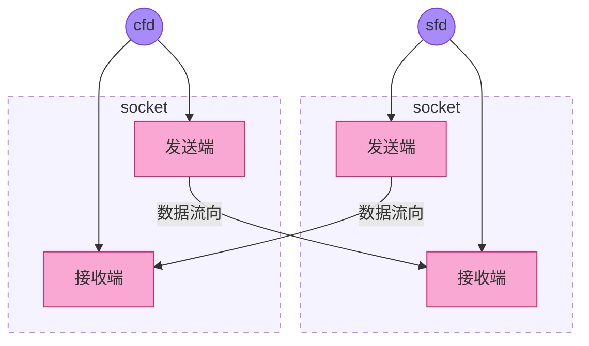
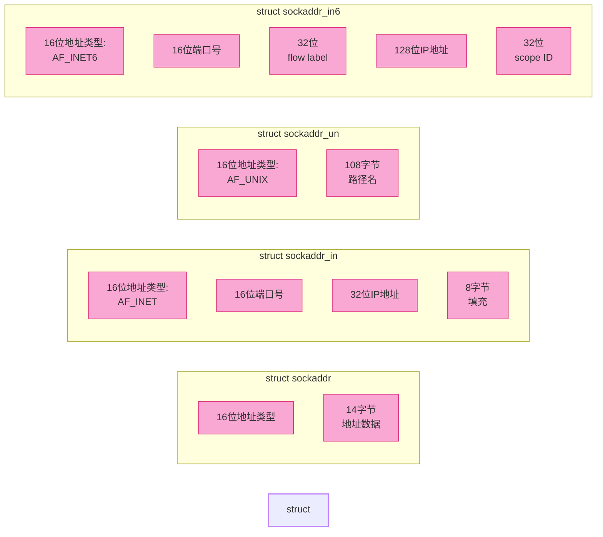

# 2 SOCKET 编程

传统的进程间通信借助内核提供的 IPC 机制进行，但是只能限于本机通信，若要跨机通信，就必须使用网络通信。（本质上借助内核-内核提供了 socket 伪文件的机制实现通信——实际上是使用文件描述符），这就需要用到内核提供给用户的 socket API 函数库。

### Socket 伪文件与文件描述符

由于 socket 被抽象为伪文件，因此可以使用标准的文件描述符操作函数（如 `read`、`write`）来进行数据收发，实现了"一切皆文件"的 Unix 哲学。

### Socket 与管道的核心区别

| 特性 | Socket | Pipe（管道） |
|------|--------|-------------|
| **文件描述符数量** | 单个 fd | 两个 fd（读端、写端） |
| **缓冲区结构** | 一个 fd 操作两个缓冲区（读/写各一个） | 两个 fd 共享一个内核缓冲区 |
| **通信方式** | 全双工（双向） | 半双工（单向，需两个管道实现双向） |
| **通信范围** | 本机/跨机 | 仅限本机 |

**关键理解**：
- **Socket**：创建时会生成一个 socket pair（一对端点），通过**单个文件描述符**即可同时访问读缓冲区和写缓冲区，实现双向通信。
- **Pipe**：创建时会生成**两个文件描述符**，分别对应读端和写端，但它们共享同一个内核缓冲区，数据只能单向流动。



## 2.1 socket 编程预备知识

### 网络字节序：

**大端和小端的概念：**

大端（Big Endian）：低位地址存放高位数据，高位地址存放低位数据。也叫高端字节序（网络字节序）。
小端（Little Endian）：低位地址存放低位数据，高位地址存放高位数据。也叫低端字节序。

**大端和小端的使用场合？**

大端和小端只是对数据类型长度是两个及以上的，如 int short，对于单字节限制，在网络中经常需要考虑大端和小端的是 IP 和端口。

**思考题：**0x12345678 如何存放？

**如何验证本机上大端还是小端？** --使用共用体。

### 字节序检测原理

**核心思想**：利用共用体（union）的特性——所有成员共享同一块内存空间。通过写入一个多字节整数，然后按字节读取，根据第一个字节的值判断是大端还是小端。

```c
#include <stdio.h>   // 包含 printf 函数
#include <stdlib.h>  // 标准库头文件

/*
共用体 un2：用于测试 short 类型（2字节）的字节序
所有成员共享同一块内存空间
*/
union
{
    short s;  // 2字节的 short 类型
    char c[sizeof(short)];  // 2个 char，每个1字节，共2字节
} un2;  // 定义共用体变量 un2

// 共用体 un4：用于测试 int 类型（4字节）的字节序
union
{
    int s;  // 4字节的 int 类型
    char c[sizeof(int)];  // 4个 char，每个1字节，共4字节
} un4;  // 定义共用体变量 un4

int main()
{
    // 打印各类型的字节大小，了解当前系统的基本数据类型长度
    printf("short = [%d] int = [%d] long = [%d]\n", sizeof(short), sizeof(int), sizeof(long int));

    // 测试 short 类型（2字节）的字节序
    un2.s = 0x0102;  // 将 0x0102 写入 short 成员
    // 按字节读取：c[0] 是低地址字节，c[1] 是高地址字节
    // 如果 c[0]=2, c[1]=1 → 小端模式（低位字节在低地址）
    // 如果 c[0]=1, c[1]=2 → 大端模式（高位字节在低地址）
    printf("short测试: c[0]=%d, c[1]=%d, s=%d\n", un2.c[0], un2.c[1], un2.s);

    // 测试 int 类型（4字节）的字节序
    un4.s = 0x01020304;  // 将 0x01020304 写入 int 成员
    // 按字节读取：c[0]~c[3] 依次是从低地址到高地址的字节
    // 小端：c[0]=4, c[1]=3, c[2]=2, c[3]=1
    // 大端：c[0]=1, c[1]=2, c[2]=3, c[3]=4
    printf("int测试: c[0]=%d, c[1]=%d, c[2]=%d, c[3]=%d, s=%d\n", 
           un4.c[0], un4.c[1], un4.c[2], un4.c[3], un4.s);
    
    return 0;
}
```

### 运行结果分析

假设在 **小端模式** 的 x86 架构上运行：

```text
short = [2] int = [4] long = [4]
short测试: c[0]=2, c[1]=1, s=258
int测试: c[0]=4, c[1]=3, c[2]=2, c[3]=1, s=16909060
```

**结论**：  
- `c[0]`（低地址）的值为 `2`（0x02），说明低位字节存放在低地址 → **小端模式**
- 现代 x86/x86-64 架构的计算机几乎都使用小端模式
- 网络协议（如 TCP/IP）使用大端模式，因此需要进行字节序转换
  
下面 4 个函数就是进行大小端转换的函数：  

```c
#include <arpa/inet.h>
uint32_t htonl(uint32_t hostlong);
uint16_t htons(uint16_t hostshort);
uint32_t ntohl(uint32_t netlong);
uint16_t ntohs(uint16_t netshort);
```

函数名的 h 表示主机 host, n 表示网络 network, s 表示 short, l 表示 long。

上述的几个函数，如果本来不需要转换函数内部就不会做转换。

### IP 地址转换函数

`p` -> 表示点分十进制的字符串形式  
`to` -> 到  
`n` -> 表示 network 网络

#### inet_pton() - 点分十进制转网络字节序

```c
int inet_pton(int af, const char *src, void *dst);
```

**函数说明**：将字符串形式的点分十进制 IP 转换为大端模式的网络 IP（整型 4 字节数）

**参数说明**：

| 参数 | 说明 |
|------|------|
| `af` | 地址族，如 `AF_INET` |
| `src` | 字符串形式的点分十进制 IP 地址 |
| `dst` | 存放转换后结果的变量地址 |

**示例**：
```c
inet_pton(AF_INET, "127.0.0.1", &serv.sin_addr.s_addr);
```

**手工计算示例**：如 `192.168.232.145`
- 192 → 0xC0
- 168 → 0xA8
- 232 → 0xE8
- 145 → 0x91

按大端字节序存放：`0xC0A8E891`

---

#### inet_ntop() - 网络字节序转点分十进制

```c
const char *inet_ntop(int af, const void *src, char *dst, socklen_t size);
```

**函数说明**：将网络字节序的整型 IP 转换为字符串形式的点分十进制 IP

**参数说明**：

| 参数 | 说明 |
|------|------|
| `af` | 地址族，如 `AF_INET` |
| `src` | 网络字节序的整型 IP 地址 |
| `dst` | 存储转换结果的字符串数组 |
| `size` | `dst` 的长度 |

**返回值**：
- 成功：返回指向 `dst` 的指针
- 失败：返回 `NULL`，同时设置 `errno`

**示例**：IP 地址 `0xC0A80A01` 转换为点分十进制：
- 0xC0 → 192
- 0xA8 → 168
- 0x0A → 10
- 0x01 → 1

结果：`192.168.10.1`

---

### socket 编程用到的重要结构体



### struct sockaddr 结构说明

`sockaddr` 是 socket API 中用于表示通用套接字地址的结构体，作为所有特定地址类型的统一接口。

```c
struct sockaddr
{
    sa_family_t sa_family;  // 地址族类型（如 AF_INET、AF_INET6、AF_UNIX）
    char sa_data[14];  // 14字节的地址数据，具体内容取决于地址族
};
```

**字段说明**：
- `sa_family`：指定地址类型，常见值有：
- `AF_INET`：IPv4 地址
- `AF_INET6`：IPv6 地址
- `AF_UNIX`：Unix 域套接字（本机进程间通信）

---

### struct sockaddr_in 结构（IPv4专用）

`sockaddr_in` 是专门用于 IPv4 地址的结构体，比通用的 `sockaddr` 更易使用。

```c
struct sockaddr_in
{
    sa_family_t sin_family;  /* 地址族：必须设置为 AF_INET */
    in_port_t sin_port;  /* 端口号（必须是网络字节序/大端模式） */
    struct in_addr sin_addr;  /* IPv4 地址结构体 */
};
```

**字段说明**：
- `sin_family`：固定为 `AF_INET`，表示这是 IPv4 地址
- `sin_port`：端口号，**必须使用 `htons()` 转换为网络字节序**
- `sin_addr`：嵌套的 `in_addr` 结构体，存储 IPv4 地址

---

### struct in_addr 结构

```c
struct in_addr
{
    uint32_t s_addr;  /* IPv4 地址（网络字节序/大端模式） */
};
```

**注意**：`s_addr` 字段存储的是 32 位整数形式的 IP 地址，**必须是网络字节序（大端模式）**。

---

**网络字节序提醒**：如前文所述，网络协议使用**大端模式**，因此 `sin_port` 和 `sin_addr.s_addr` 必须转换为网络字节序。常用转换函数：
- `htons()`：端口号转换（host to network short）
- `inet_pton()`：字符串 IP 转网络字节序

---

### 使用示例

```c
struct sockaddr_in serv_addr;

// 初始化地址结构
memset(&serv_addr, 0, sizeof(serv_addr));
serv_addr.sin_family = AF_INET;  // IPv4
serv_addr.sin_port = htons(8080);  // 端口号转网络字节序
inet_pton(AF_INET, "127.0.0.1", &serv_addr.sin_addr.s_addr);  // IP转网络字节序
```

---

### 结构转换

在调用 socket API 时（如 `bind()`、`connect()`），需要将 `sockaddr_in` 强制转换为 `struct sockaddr*`：

```c
bind(sockfd, (struct sockaddr*)&serv_addr, sizeof(serv_addr));
```

> **提示**：通过 `man 7 ip` 命令可以查看 Linux 系统中 IPv4 相关的详细手册。

## 2.2 socket 主要的 API 函数介绍

### 2.2.1 socket() - 创建套接字

```c
#include <sys/socket.h>
int socket(int domain, int type, int protocol);
```

**功能**：创建一个套接字文件描述符。

**参数说明**：
| 参数 | 说明 | 常用值 |
|------|------|--------|
| `domain` | 地址族 | `AF_INET`（IPv4）、`AF_INET6`（IPv6）、`AF_UNIX`（本地） |
| `type` | 套接字类型 | `SOCK_STREAM`（TCP）、`SOCK_DGRAM`（UDP） |
| `protocol` | 协议类型 | 0（自动选择）、`IPPROTO_TCP`、`IPPROTO_UDP` |

**返回值**：成功返回文件描述符，失败返回 -1 并设置 `errno`。

**示例**：
```c
// 创建 TCP 套接字
int sockfd = socket(AF_INET, SOCK_STREAM, 0);
if (sockfd == -1)
{
    perror("socket failed");
    exit(EXIT_FAILURE);
}
```

---

### 2.2.2 bind() - 绑定地址

```c
int bind(int sockfd, const struct sockaddr *addr, socklen_t addrlen);
```

**功能**：将套接字绑定到指定的 IP 地址和端口。

**参数说明**：
| 参数 | 说明 |
|------|------|
| `sockfd` | socket() 返回的文件描述符 |
| `addr` | 指向 sockaddr 结构体的指针 |
| `addrlen` | 结构体大小 |

**返回值**：成功返回 0，失败返回 -1。

**示例**：
```c
struct sockaddr_in serv_addr;
memset(&serv_addr, 0, sizeof(serv_addr));
serv_addr.sin_family = AF_INET;
serv_addr.sin_port = htons(8080);
serv_addr.sin_addr.s_addr = INADDR_ANY;  // 绑定所有可用接口

if (bind(sockfd, (struct sockaddr*)&serv_addr, sizeof(serv_addr)) == -1)
{
    perror("bind failed");
    close(sockfd);
    exit(EXIT_FAILURE);
}
```

---

### 2.2.3 listen() - 监听连接

```c
int listen(int sockfd, int backlog);
```

**功能**：将套接字转为被动监听状态，准备接受连接。

**参数说明**：
| 参数 | 说明 |
|------|------|
| `sockfd` | 已绑定的套接字描述符 |
| `backlog` | 等待队列的最大长度（已完成三次握手但未 accept 的连接数） |

**返回值**：成功返回 0，失败返回 -1。

**示例**：
```c
if (listen(sockfd, 5) == -1)
{
    perror("listen failed");
    close(sockfd);
    exit(EXIT_FAILURE);
}
```

---

### 2.2.4 accept() - 接受连接

```c
int accept(int sockfd, struct sockaddr *addr, socklen_t *addrlen);
```

**功能**：从等待队列中取出一个连接，创建新的套接字用于通信。

**参数说明**：
| 参数 | 说明 |
|------|------|
| `sockfd` | 监听套接字描述符 |
| `addr` | 用于存储客户端地址（可设为 NULL） |
| `addrlen` | 地址结构体大小（可设为 NULL） |

**返回值**：成功返回新的连接套接字，失败返回 -1。

**示例**：
```c
struct sockaddr_in cli_addr;
socklen_t cli_len = sizeof(cli_addr);

int connfd = accept(sockfd, (struct sockaddr*)&cli_addr, &cli_len);
if (connfd == -1)
{
    perror("accept failed");
    close(sockfd);
    exit(EXIT_FAILURE);
}

// 成功接受连接，connfd 用于与客户端通信
```

---

### 2.2.5 connect() - 连接服务器

```c
int connect(int sockfd, const struct sockaddr *addr, socklen_t addrlen);
```

**功能**：主动发起与服务器的连接。

**参数说明**：
| 参数 | 说明 |
|------|------|
| `sockfd` | 客户端套接字描述符 |
| `addr` | 服务器地址结构体 |
| `addrlen` | 地址结构体大小 |

**返回值**：成功返回 0，失败返回 -1。

**示例**：
```c
struct sockaddr_in serv_addr;
memset(&serv_addr, 0, sizeof(serv_addr));
serv_addr.sin_family = AF_INET;
serv_addr.sin_port = htons(8080);
inet_pton(AF_INET, "127.0.0.1", &serv_addr.sin_addr.s_addr);

if (connect(sockfd, (struct sockaddr*)&serv_addr, sizeof(serv_addr)) == -1)
{
    perror("connect failed");
    close(sockfd);
    exit(EXIT_FAILURE);
}
```

---

### 2.2.6 send() / recv() - 数据收发

```c
ssize_t send(int sockfd, const void *buf, size_t len, int flags);
ssize_t recv(int sockfd, void *buf, size_t len, int flags);
```

**功能**：发送/接收数据（TCP 流式套接字）。

**参数说明**：
| 参数 | 说明 |
|------|------|
| `sockfd` | 连接套接字描述符 |
| `buf` | 数据缓冲区 |
| `len` | 数据长度 |
| `flags` | 标志位（通常为 0） |

**返回值**：成功返回实际发送/接收的字节数，失败返回 -1。

**示例**：
```c
// 发送数据
char *msg = "Hello, Server!";
ssize_t bytes_sent = send(connfd, msg, strlen(msg), 0);

// 接收数据
char buffer[1024];
ssize_t bytes_read = recv(connfd, buffer, sizeof(buffer)-1, 0);
if (bytes_read > 0)
{
    buffer[bytes_read] = '\0';
    printf("Received: %s\n", buffer);
}
```

---

### 2.2.7 close() - 关闭套接字

```c
int close(int sockfd);
```

**功能**：关闭套接字，释放相关资源。

**参数说明**：
| 参数 | 说明 |
|------|------|
| `sockfd` | 要关闭的套接字描述符 |

**返回值**：成功返回 0，失败返回 -1。

**示例**：
```c
close(connfd);  // 关闭连接套接字
close(sockfd);  // 关闭监听套接字
```

---

### 2.2.8 完整的 TCP 服务端流程

```c
// 1. 创建套接字
int sockfd = socket(AF_INET, SOCK_STREAM, 0);

// 2. 设置端口复用（可选但推荐）
int opt = 1;
setsockopt(sockfd, SOL_SOCKET, SO_REUSEADDR, &opt, sizeof(opt));

// 3. 绑定地址
struct sockaddr_in serv_addr = {0};
serv_addr.sin_family = AF_INET;
serv_addr.sin_port = htons(8080);
serv_addr.sin_addr.s_addr = INADDR_ANY;
bind(sockfd, (struct sockaddr*)&serv_addr, sizeof(serv_addr));

// 4. 监听
listen(sockfd, 5);

// 5. 接受连接（循环处理）
while (1)
{
    int connfd = accept(sockfd, NULL, NULL);
    
    // 处理客户端请求
    char buf[1024];
    recv(connfd, buf, sizeof(buf), 0);
    send(connfd, "OK", 2, 0);
    
    close(connfd);
}

// 6. 关闭
close(sockfd);
```

---

### 2.2.9 完整的 TCP 客户端流程

```c
// 1. 创建套接字
int sockfd = socket(AF_INET, SOCK_STREAM, 0);

// 2. 连接服务器
struct sockaddr_in serv_addr = {0};
serv_addr.sin_family = AF_INET;
serv_addr.sin_port = htons(8080);
inet_pton(AF_INET, "127.0.0.1", &serv_addr.sin_addr.s_addr);
connect(sockfd, (struct sockaddr*)&serv_addr, sizeof(serv_addr));

// 3. 发送和接收数据
send(sockfd, "Hello", 5, 0);

char buf[1024];
recv(sockfd, buf, sizeof(buf), 0);

// 4. 关闭
close(sockfd);
```

---

### 关键注意事项

| 要点 | 说明 |
|------|------|
| **错误处理** | 每个系统调用都可能失败，必须检查返回值 |
| **字节序转换** | 端口号和 IP 地址必须转换为网络字节序 |
| **资源释放** | 不再使用的套接字必须关闭，避免资源泄漏 |
| **并发处理** | 单线程 accept 只能处理一个连接，需用多进程/多线程/IO多路复用 |


